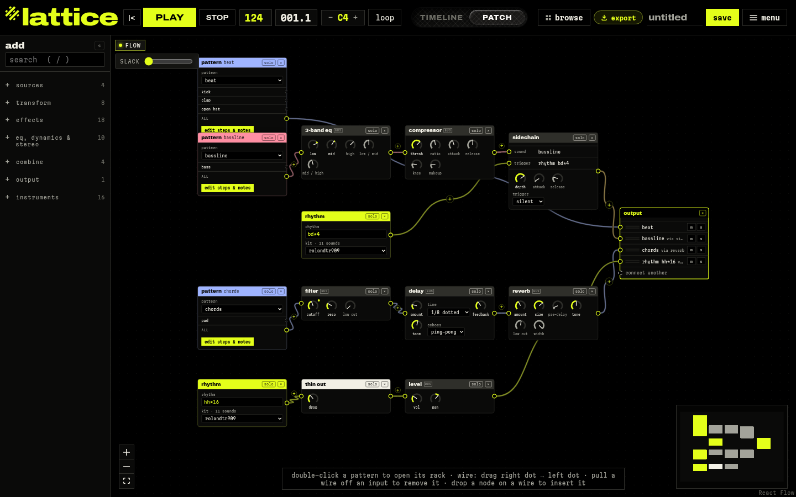
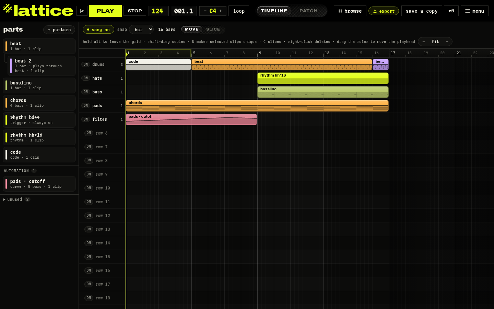
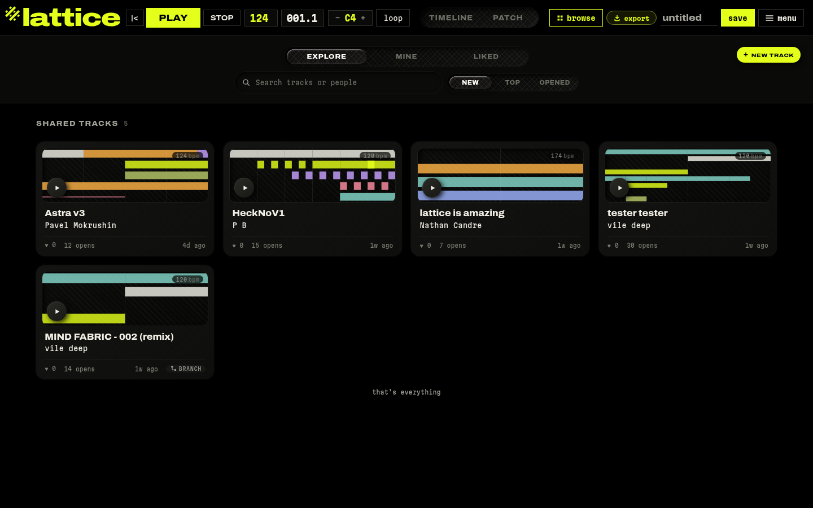

# lattice

**Make music in your browser by connecting boxes together.**

lattice is a music studio built on [Strudel](https://strudel.cc). You drop in drums,
basslines, chords and effects, wire them up, and hear the result right away. You don't
install anything and you don't need to write any code.

👉 **Try it at [lattice.bwnd.app](https://lattice.bwnd.app)**



---

## How it works

### 1. Build your sound

In **Patch** view, each box is either a sound (a beat, a bassline, a chord) or an effect
(filter, delay, reverb, compressor…). To send a sound through an effect, drag a wire
from one box to the next. Turn the knobs and you'll hear the change straight away.

### 2. Arrange your song



Switch to **Timeline** to lay out your parts over time. Drag clips around, stretch them,
copy them, and draw automation curves, such as a filter opening up over eight bars.

### 3. Share it



When you save a track you can share it. On **Browse** you can play other people's tracks,
like them, or make your own copy and remix it. Every track keeps its save history, so you
can see how it grew.

---

## Running it yourself

```sh
cd frontend
npm install
npm run dev
```

Then open the address it prints. The app is React. The small server behind it, in
`src/api/`, is Python (FastAPI) and stores tracks in SQLite.

## Where things live

| Folder | What's in it |
|---|---|
| `frontend/` | the app you see in the browser |
| `src/api/` | the server: saving tracks, likes, sharing, playing together live |
| `test/` | tests |
| `tools/` | helper scripts |

## Licence

Strudel is free software under the AGPL-3.0 licence, so lattice is too
(**AGPL-3.0-or-later**, see [LICENSE](LICENSE)). You're free to read the code, change it
and run your own copy. The licence covers the app only. Any music you make with it is yours.
